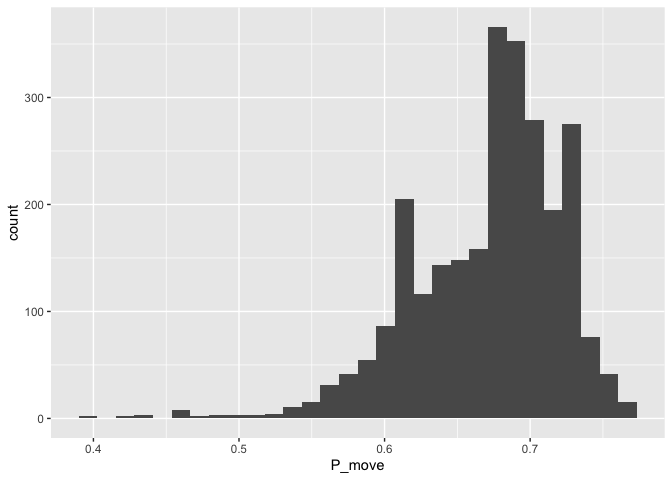
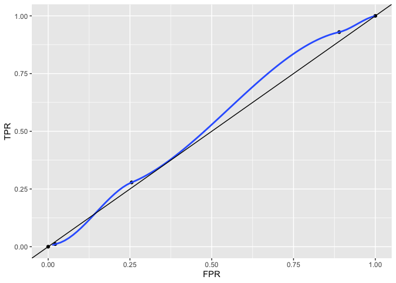

S6 Prediction
================

## Predict mobility across art units as a function of tenure and TC

We will be using data from `examiner_aus.csv` file. The file contains
the data on for art units (AUs) where the examiner worked in a given
month. Let’s count the number of moves as the number of distinct AUs
associated with an examiner, minus one.

``` r
# count examiner moves
examiner_moves <- examiner_au %>% 
  arrange(old_pid,year,month) %>% 
  distinct(old_pid,examiner_art_unit) %>% # keep unique examiner-AU combinations
  group_by(old_pid) %>% 
  mutate(
    au = examiner_art_unit,
    tc = floor(au/100)*100,
    moves = (n()-1)
  ) %>% 
  ungroup()

datasummary_skim(examiner_moves, histogram=FALSE)
```

|                   | Unique (#) | Missing (%) |   Mean |     SD | Min | Median |     Max |
|:------------------|-----------:|------------:|-------:|-------:|----:|-------:|--------:|
| old_pid           |      13042 |           0 | 9461.0 | 6723.6 | 1.0 | 8745.0 | 40465.0 |
| examiner_art_unit |       1307 |           0 | 2865.5 |  920.6 | 2.0 | 2665.0 |  9984.0 |
| au                |       1307 |           0 | 2865.5 |  920.6 | 2.0 | 2665.0 |  9984.0 |
| tc                |         97 |           0 | 2818.0 |  920.8 | 0.0 | 2600.0 |  9900.0 |
| moves             |         18 |           0 |    2.3 |    2.3 | 0.0 |    2.0 |    26.0 |

There are only [9 TCs at the
organization](https://www.uspto.gov/patents/contact-patents/patent-technology-centers-management),
not 97. Some AU values must be wrong. Each legitimate TC likely has 1000
or more examiners, so we’ll filter on that.

``` r
# adjust for the wrong AU values
examiner_moves <- examiner_au %>% 
  arrange(old_pid,year,month) %>% 
  distinct(old_pid,examiner_art_unit) %>% 
  mutate(tc = floor(examiner_art_unit/100)*100) %>% 
  add_count(tc) %>% 
  mutate(
    tc = if_else(n<1000,NA_real_,tc), # TCs with fewer than 1K examiners are not real
  ) %>% 
  filter(!is.na(tc)) %>% # drop them
  select(-n) %>% 
  group_by(old_pid) %>% 
  mutate(
    first_au = if_else(row_number()==1,examiner_art_unit,0),
    moves = (n()-1),
    has_moved = if_else(moves>0,1,0)
  ) %>% 
  ungroup() %>% 
  filter(first_au!=0) %>% 
  select(
    old_pid,
    first_au,
    first_tc = tc,
    moves,
    has_moved
  )
datasummary_skim(examiner_moves, histogram=FALSE)
```

|           | Unique (#) | Missing (%) |   Mean |     SD |    Min | Median |     Max |
|:----------|-----------:|------------:|-------:|-------:|-------:|-------:|--------:|
| old_pid   |      12870 |           0 | 9650.2 | 6981.9 |    1.0 | 8847.5 | 40465.0 |
| first_au  |        571 |           0 | 3000.6 |  900.0 | 1609.0 | 2841.0 |  4199.0 |
| first_tc  |          9 |           0 | 2955.5 |  898.6 | 1600.0 | 2800.0 |  4100.0 |
| moves     |         17 |           0 |    1.3 |    1.4 |    0.0 |    1.0 |    25.0 |
| has_moved |          2 |           0 |    0.7 |    0.5 |    0.0 |    1.0 |     1.0 |

Now, we will add gender and tenure variables.

``` r
# add examiner gender and tenure
examiner_gender_tenure <- examiner_gs %>% 
  filter(!is.na(gender)) %>% 
  mutate(
    woman = if_else(gender=="female",1,0)
  ) %>%
  group_by(old_pid) %>% 
  summarise(
    woman = max(woman),
    tenure = sum(days_in_grade)/365
  )

datasummary_skim(examiner_gender_tenure, histogram=FALSE)
```

|         | Unique (#) | Missing (%) |   Mean |     SD |   Min | Median |     Max |
|:--------|-----------:|------------:|-------:|-------:|------:|-------:|--------:|
| old_pid |      14431 |           0 | 7572.1 | 4378.0 |   3.0 | 7552.0 | 16081.0 |
| woman   |          2 |           0 |    0.3 |    0.4 |   0.0 |    0.0 |     1.0 |
| tenure  |       1108 |           0 |   11.0 |    7.1 | -52.3 |    9.9 |    46.2 |

Some tenure values are clearly out of whack. Negative 52 years! Setting
them to missing.

``` r
# remove negative tenure values
examiner_gender_tenure <- examiner_gender_tenure %>% 
  filter(tenure>0)

# add back to the examiner_moves
examiner_moves <- examiner_moves %>% 
  left_join(examiner_gender_tenure)
```

    ## Joining, by = "old_pid"

``` r
datasummary_skim(examiner_gender_tenure, histogram=FALSE)
```

|         | Unique (#) | Missing (%) |   Mean |     SD | Min | Median |     Max |
|:--------|-----------:|------------:|-------:|-------:|----:|-------:|--------:|
| old_pid |      14396 |           0 | 7570.9 | 4378.3 | 3.0 | 7548.5 | 16081.0 |
| woman   |          2 |           0 |    0.3 |    0.4 | 0.0 |    0.0 |     1.0 |
| tenure  |       1102 |           0 |   11.0 |    7.0 | 0.0 |    9.9 |    46.2 |

## Model selection

First, let’s see how tenure predicts mobility across AUs.

``` r
ols1 <-  lm(has_moved ~ tenure, data = examiner_moves)
modelsummary(ols1)
```

|             |  Model 1  |
|:------------|:---------:|
| (Intercept) |   0.766   |
|             |  (0.009)  |
| tenure      |  -0.008   |
|             |  (0.001)  |
| Num.Obs.    |   10477   |
| R2          |   0.013   |
| R2 Adj.     |   0.012   |
| AIC         |  13795.4  |
| BIC         |  13817.1  |
| Log.Lik.    | -6894.688 |
| F           |  133.527  |

Looks like the relationship is negative, though not very strong. Now,
let’s look at what produces *R*<sup>2</sup>. First, we estimate
predicted values based on *β̂* that the model has estimated.

``` r
examiner_moves <- examiner_moves %>% 
  add_predictions(ols1, var = "P_move")
examiner_moves
```

    ## # A tibble: 12,870 x 8
    ##    old_pid first_au first_tc moves has_moved woman tenure P_move
    ##      <dbl>    <dbl>    <dbl> <dbl>     <dbl> <dbl>  <dbl>  <dbl>
    ##  1       1     3753     3700     2         1    NA  NA    NA    
    ##  2       2     3744     3700     0         0    NA  NA    NA    
    ##  3       3     4134     4100     2         1     0   8.78  0.692
    ##  4       5     3763     3700     1         1     0  11.4   0.670
    ##  5       7     2114     2100     1         1     0  12.4   0.662
    ##  6       8     3713     3700     0         0     0  17.0   0.623
    ##  7      10     2625     2600     1         1     0   5.91  0.716
    ##  8      11     1775     1700     4         1     0  10.7   0.676
    ##  9      12     3743     3700     0         0     0  20.8   0.591
    ## 10      13     2153     2100     2         1     0  12.9   0.657
    ## # … with 12,860 more rows

The field `P_move` contains estimated probability that an examiner has
moved art units, based on the simple model above (i.e., just on the
value of tenure in years). If we estimate the correlation between these
predicted values (i.e., *Ŷ*) and true observed values in column
`has_moved` (i.e., *Y*), we get a number.

``` r
corr_ols1 <- examiner_moves %>% 
  observe(has_moved ~ P_move, stat = "correlation") %>% 
  pull(stat)
corr_ols1
```

    ## [1] 0.1121906

If we square that number, we get the *R*<sup>2</sup> value from the
regression output above! It’s as simple as that.

``` r
corr_ols1^2
```

    ## [1] 0.01258674

This is a model fit statistic. But today we are interested in
prediction.

## Prediction

To assess how good our model is for predicting outcomes, we need to do a
few things. First, we need to make sure we use a random sample of data
to estimate the model and some other *different* part of the data to
test it. Otherwise we are risking overfitting the model, so that its
prediction is good within the sample, but not so good with any other
data.

``` r
# estimation sample
est_sample <- examiner_moves %>% 
  select(
    old_pid,
    first_au,
    first_tc,
    has_moved,
    woman,
    tenure
  ) %>% 
  slice_sample(n = 9652) # randomly select about 85% of the data

# holdout data for validation
test_sample <- examiner_moves %>% 
  anti_join(est_sample) %>% 
  select(
    old_pid,
    first_au,
    first_tc,
    has_moved,
    woman,
    tenure
  ) 
```

    ## Joining, by = c("old_pid", "first_au", "first_tc", "has_moved", "woman", "tenure")

Let’s estimate the same model on our training data.

``` r
pr_ols1 <- lm(has_moved ~ tenure, data = est_sample)

modelsummary(pr_ols1)
```

|             |  Model 1  |
|:------------|:---------:|
| (Intercept) |   0.764   |
|             |  (0.011)  |
| tenure      |  -0.008   |
|             |  (0.001)  |
| Num.Obs.    |   7836    |
| R2          |   0.012   |
| R2 Adj.     |   0.012   |
| AIC         |  10313.7  |
| BIC         |  10334.6  |
| Log.Lik.    | -5153.858 |
| F           |  95.755   |

``` r
test_sample <- test_sample %>% 
  add_predictions(pr_ols1, var = "P_move")
```

The model estimates look similar to the ones we had based on the full
sample. This is expected, since we are using a random subset of that
sample.

### Thresholds

The question is what to do with these predicted values? As you can see,
we have predicted probability of move `P_move`, but an examiner either
moves or doesn’t. How do we deal with that? One way is to set a
threshold for this binary prediction. If Pr(move) is higher than that
threshold, we’ll count this prediction as predicting a move. If it’s
lower, we’ll count such prediction as no move.

But where so set this threshold? The distribution of `P_move` is
continuous and it’s not obvious where to cut it:

``` r
g <- ggplot(data = test_sample, mapping = aes(x = P_move))
g + geom_histogram(orientation = "")
```

    ## `stat_bin()` using `bins = 30`. Pick better value with `binwidth`.

<!-- -->

We’ll use **sensitivity** (True Positive Rate, TPR) and its inverse
(False Positive Rate, FPR) to see how various thresholds are affecting
the quality of our prediction, given the model.

Let’s pick a threshold that’s close to the center of the distribution,
say 0.7, and generate predicted binary outcome for the move, given this
threshold `pr_moved_tr1`.

``` r
tr1 <- 0.7

test_sample <- test_sample %>% 
  mutate(pr_moved_tr1 = if_else(P_move>tr1,1,0))
test_sample
```

    ## # A tibble: 3,218 x 8
    ##    old_pid first_au first_tc has_moved woman tenure P_move pr_moved_tr1
    ##      <dbl>    <dbl>    <dbl>     <dbl> <dbl>  <dbl>  <dbl>        <dbl>
    ##  1      21     4135     4100         1     0   4.22  0.730            1
    ##  2      22     2838     2800         1     0   8.09  0.698            0
    ##  3      26     3739     3700         1     0  14.2   0.648            0
    ##  4      30     3735     3700         0     0   9.78  0.684            0
    ##  5      37     4131     4100         1     0   8.13  0.698            0
    ##  6      41     2625     2600         1     0  14.2   0.648            0
    ##  7      44     2876     2800         1     0  10.6   0.678            0
    ##  8      50     3679     3600         0     0  16.9   0.626            0
    ##  9      51     3714     3700         0     0  14.8   0.643            0
    ## 10      55     3714     3700         0     0  11.0   0.674            0
    ## # … with 3,208 more rows

Let’s calculate TPR and FPR based on true/false positives and true/false
negatives.

``` r
gof_tr1 <- test_sample %>% 
  filter(!is.na(P_move)) %>% 
  mutate(
    TP = if_else(pr_moved_tr1==1 & has_moved==1,1,0),
    FP = if_else(pr_moved_tr1==1 & has_moved==0,1,0),
    TN = if_else(pr_moved_tr1==0 & has_moved==0,1,0),
    FN = if_else(pr_moved_tr1==0 & has_moved==1,1,0)
  )  %>% 
  summarise(
    a = sum(TP),
    b = sum(FN),
    c = sum(FP),
    d = sum(TN)
  ) %>% 
  mutate(
    TPR = a/(a+b),
    FPR = c/(c+d)
  )

gof_tr1
```

    ## # A tibble: 1 x 6
    ##       a     b     c     d   TPR   FPR
    ##   <dbl> <dbl> <dbl> <dbl> <dbl> <dbl>
    ## 1   491  1272   224   654 0.279 0.255

So, with this threshold, we’ll predict a move correctly when it happened
28 percent of the time. But note that we also predict the move when it
didn’t actually happen 25.5 percent of the time.

Can we do better with a different threshold? Let’s try a smaller one,
say 0.6

``` r
tr2 <- 0.6

test_sample <- test_sample %>% 
  mutate(pr_moved_tr2 = if_else(P_move>tr2,1,0))

gof_tr2 <- test_sample %>% 
  filter(!is.na(P_move)) %>% 
  mutate(
    TP = if_else(pr_moved_tr2==1 & has_moved==1,1,0),
    FP = if_else(pr_moved_tr2==1 & has_moved==0,1,0),
    TN = if_else(pr_moved_tr2==0 & has_moved==0,1,0),
    FN = if_else(pr_moved_tr2==0 & has_moved==1,1,0)
  )  %>% 
  summarise(
    a = sum(TP),
    b = sum(FN),
    c = sum(FP),
    d = sum(TN)
  ) %>% 
  mutate(
    TPR = a/(a+b),
    FPR = c/(c+d)
  )

gof_tr2
```

    ## # A tibble: 1 x 6
    ##       a     b     c     d   TPR   FPR
    ##   <dbl> <dbl> <dbl> <dbl> <dbl> <dbl>
    ## 1  1639   124   781    97 0.930 0.890

Well, our true positive rate is definitely better. We predict a move
correctly 93% of the time! But look at what happened with the false
positives – we predict a move when there was no move 89% of the time.
That’s a lot of false predictions!

It seems that by moving the threshold we are engaging in a tradeoff. One
type of error is reduced, but that increases another type. Let’s try one
more threshold.

``` r
tr3 <- 0.75

test_sample <- test_sample %>% 
  mutate(pr_moved_tr3 = if_else(P_move>tr3,1,0))

gof_tr3 <- test_sample %>% 
  filter(!is.na(P_move)) %>% 
  mutate(
    TP = if_else(pr_moved_tr3==1 & has_moved==1,1,0),
    FP = if_else(pr_moved_tr3==1 & has_moved==0,1,0),
    TN = if_else(pr_moved_tr3==0 & has_moved==0,1,0),
    FN = if_else(pr_moved_tr3==0 & has_moved==1,1,0)
  )  %>% 
  summarise(
    a = sum(TP),
    b = sum(FN),
    c = sum(FP),
    d = sum(TN)
  ) %>% 
  mutate(
    TPR = a/(a+b),
    FPR = c/(c+d)
  )

gof_tr3
```

    ## # A tibble: 1 x 6
    ##       a     b     c     d    TPR    FPR
    ##   <dbl> <dbl> <dbl> <dbl>  <dbl>  <dbl>
    ## 1    20  1743    19   859 0.0113 0.0216

Again, moving along the tradeoff, but in the other direction now. The
false predictions are very low, but the true predictions are terrible.

## ROC plots

You can imagine that we can be selecting the threshold in small
increments, which can produce a set of values. We can then plot that set
of values on what’s called ROC plot.

``` r
start_end <- tibble(TPR = c(0,1), FPR = c(0,1))
## ROC
roc_data <- gof_tr1 %>% 
  add_row(gof_tr2) %>% 
  add_row(gof_tr3) %>% 
  select(TPR,FPR) %>% 
  add_row(start_end)

roc_data
```

    ## # A tibble: 5 x 2
    ##      TPR    FPR
    ##    <dbl>  <dbl>
    ## 1 0.279  0.255 
    ## 2 0.930  0.890 
    ## 3 0.0113 0.0216
    ## 4 0      0     
    ## 5 1      1

``` r
g <- ggplot(roc_data, aes(x = FPR, y= TPR))

g + geom_point() +
  geom_smooth() +
  geom_abline(intercept = 0) +
  xlim(0,1)+
  ylim(0,1)
```

    ## `geom_smooth()` using method = 'loess' and formula 'y ~ x'

<!-- -->

[ROC
curves](https://en.wikipedia.org/wiki/Receiver_operating_characteristic)
are useful because we can compare how different models – or, in fact,
any prediction methods – perform on the prediction tasks. The closer the
curve is to the top left corner, the better the prediction.
